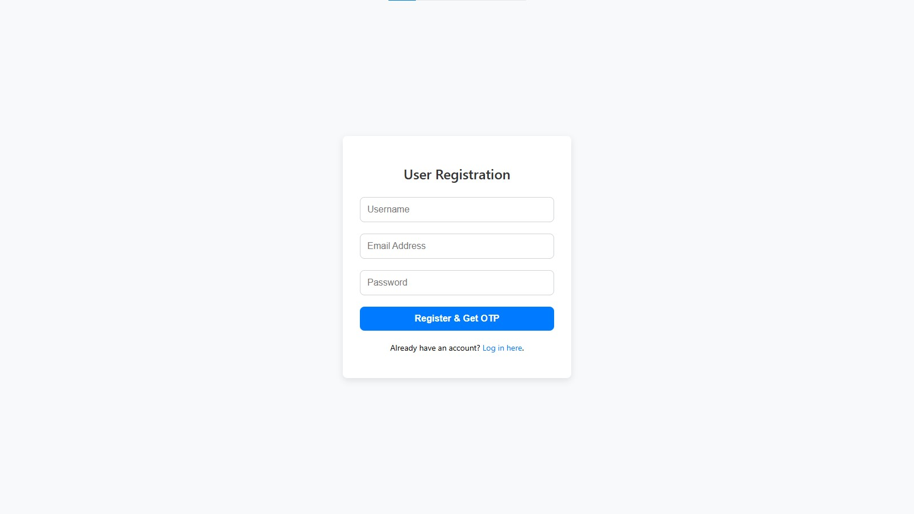
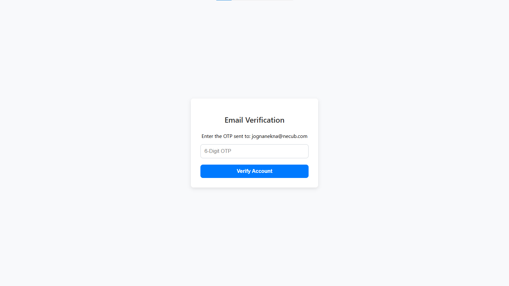
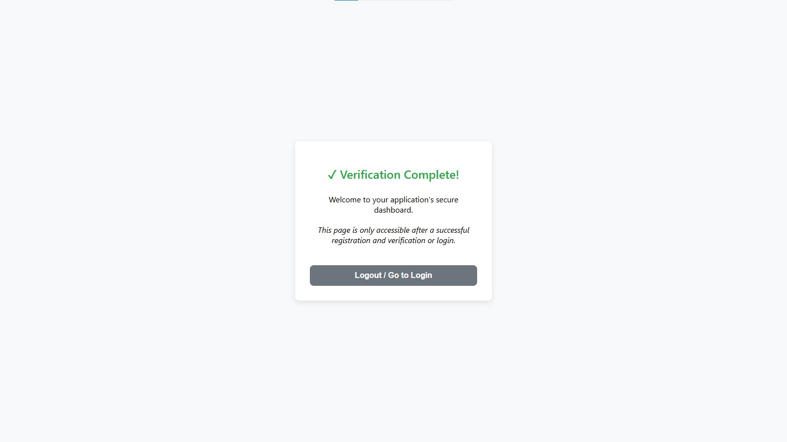
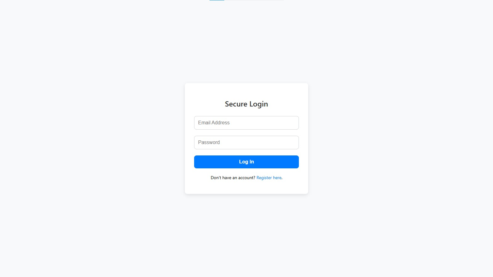

# 🔒 Secure User Registration & Email Verification API

This project implements a secure user registration and login workflow using **Node.js**, **Express**, and **MongoDB**, fulfilling the requirements for **Lab 6**.  
The core functionality centers on **email verification using a One-Time Password (OTP)** to ensure account authenticity.

---

## ✨ Features

- **Secure Registration:** Registers new users with **bcrypt** password hashing.
- **Email Verification:** Sends a unique OTP via **Nodemailer** for email confirmation.
- **Database Integration:** Uses **MongoDB Atlas** with **Mongoose** to store users (verified/unverified) and time-bound OTPs.
- **Secure Login:** Compares hashed passwords and checks the `isVerified` status before granting access.
- **Modern Frontend:** Responsive, minimalistic HTML/CSS/JS frontend to demonstrate the complete user flow.

---

## 🛠️ Technology Stack

- **Backend:** Node.js, Express.js  
- **Database:** MongoDB (via Mongoose)  
- **Authentication:** OTP Email Verification, bcrypt Hashing  
- **Email:** Nodemailer (configured for external SMTP like Gmail/Mailtrap)  

---

## 🚀 Setup and Installation

### 1. Prerequisites
- Node.js (v14+)  
- MongoDB Atlas Account  
- SMTP Credentials (e.g., Gmail App Password or Mailtrap)  

---

### 2. Installation Steps

```bash
# Clone the repository
git clone https://github.com/anirudhlohiya/secure-email-otp-registration-lab.git
cd secure-email-otp-registration-lab

# Install dependencies
npm install
```

---

### 3. Environment Configuration

Create a file named `.env` in the root directory.  

Copy the content from `sample.env` into your new `.env` file, then fill in the required values:

| Variable            | Description                                      |
|----------------------|--------------------------------------------------|
| `MONGO_URI`         | Your MongoDB Atlas connection string              |
| `EMAIL_USER`        | Email address used for sending OTPs              |
| `EMAIL_PASS`        | Your Gmail App Password or SMTP password         |
| `OTP_EXPIRY_MINUTES`| OTP expiration time in minutes                   |

---

### 4. Running the Application

```bash
npm start
```

Visit: **[http://localhost:3000/register.html](http://localhost:3000/register.html)**  

---

## 💻 API Endpoints

All endpoints are prefixed with `/api`.

| Method | Endpoint            | Description                                                                 |
|--------|---------------------|-----------------------------------------------------------------------------|
| POST   | `/api/register`     | Accepts username, email, password. Hashes password, saves user (unverified), generates OTP, and sends email. |
| POST   | `/api/verify-email` | Accepts email and OTP. Checks validity, updates user `isVerified: true`, and deletes the OTP record. |
| POST   | `/api/login`        | Accepts email and password. Compares hash and checks `isVerified` status. |

---

## 📸 Screenshots: Full User Flow Demonstration

This sequence demonstrates the complete secure flow from registration to successful login:

1. **Registration Page (`register.html`)**  
   Minimalistic form to collect credentials and includes a link for users who are already registered.  
   

2. **Verification Page (`verify.html`)**  
   Prompts the user to enter the OTP (which also appears in the console for testing).  
   

3. **Successful Login / Secured Dashboard (`login.html → dashboard.html`)**  
   Confirms the user is verified and can successfully log into the protected area.  
   

4. **Login Page (`login.html`)**  
   Allows already registered and verified users to log in securely.  
   

---

## 📂 Project Structure (Optional for Clarity)

```
secure-email-otp-registration-lab/
│── public/
│   ├── register.html
│   ├── verify.html
│   ├── login.html
│   └── dashboard.html
│
│── routes/
│   ├── authRoutes.js
│
│── models/
│   ├── userModel.js
│   ├── otpModel.js
│
│── server.js
│── sample.env
│── package.json
└── README.md
```

---

## ✅ Future Improvements

- Add rate-limiting to prevent brute force OTP attempts  
- Use JWT for session management  
- Deploy the project on **Render/Heroku** with MongoDB Atlas integration  

---
